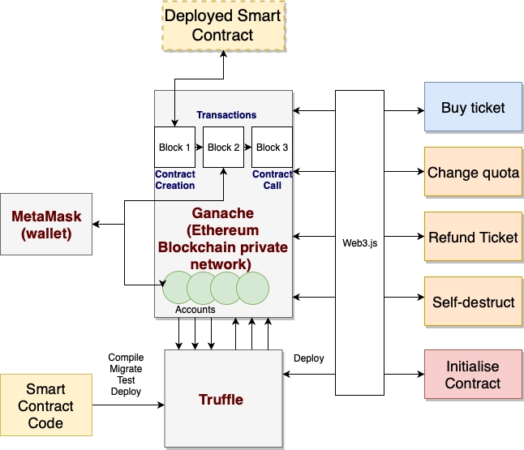

# Ethereum Smart Contract workshop

This is an Ethereum Smart Contract tutorial which assumes no prior experience 
with Smart Contract development. It has a step by step guide how to set-up a 
development and testing environment for Ethereum Smart Contracts, then write and 
test simple Smart Contract section. Finally it show how to create an example 
web UI application that interacts with the Smart Contract.   

## 0. Workshop Overview
* Setup local development and testing environment for Ethereum Smart Contrats
* Write simple Ethereum Smart Contract using Solidity development language
* Write tests for the Smart Contract
* Write very simple DApp (distributed Application) - that interacts with the 
Smart Contract using web3.js API

### What we will build?
The final result of the workshop will be simple distributed application with UI 
running on local node.js server and interacting with an `EventTickets` 
Smart Contract deployed on local Blockchain network. 
The application and Smart Contract we are going to build is a general simplified 
event tickets purchase platform. This platform will:
- allow anyone to buy a ticket for an event
- allow event organiser to refund previously bought ticket
- allow event organiser change tickets quota for an event
- allow event organiser to collect money for the tickets bought

The difference of this DApp and traditional application is that key application 
logic and state (number of attendees, money received for tickets, attendees 
list etc.) will be kept in the Smart Contract. Also all payments and refunds for 
the tickets will be done in Ethereum Blockchain network using Ether 
crypto-currency. As there is no central application database as Blockchain 
network is ditributed - the application is called `distributed` application 
- DApp.

### Workshop DApp
Below you can see a diagram of the Smart Contract development, testing and local 
deployment environment that we will use for this workshop. Also this diagram 
shows DApp interactions with the `EventTickets` Smart Contract deployed on 
the local Blockchain network through 4 actions:
- Buy ticket
- Change quota
- Refund Ticket
- Self-destruct
The `Initialise Contract` action is done on initial DApp load. All DApp 
interactions with Blockchain network happen via `web3.js` library.



### Background reading 
You should familiarize yourself more with:
* Blockchain
* Ethereum Smart Contracts
* Ethereum Virtual Machine, Ethereum Node
* DApp (distributed Application)

### Prerequisites
* General software engineering and development understanding and some 
experience.
* Unix-based system would be the best option. All further environment setup 
instructions prepared and tested on Mac OS, however, it should work on any OS. 
* Preferred IDE for Smart Contract development. You can use any IDE you like, 
for example the one you already have installed. If you like to try something 
new, there is an interesting one - browser based IDE - one of the top tools 
for Smart Contract development - [Remix IDE](https://remix.ethereum.org).

## 1. Local Development, Testing and Deployment Environment
Smart Contract development and testing environment consist of local Blockchain 
network - `Ganache`, development command-line tool `Truffle` and `node.js`  
with `web3.js` javascript library for interacting with Smart Contracts. To 
interact with real Ethereum Blockchain network, one needs a local Ethereum 
node. However, for the development and testing environment Ethereum node is 
not needed, as `Ganache` has a RPC server, which allows `Truffle` and `web3.js` 
to interact with local Blockchain network. You can optionally install `MetaMask` 
which is local crypto-currency wallet. It will allow you to make transactions 
between you local testing accounts. See the [diagram](#Workshop DApp) above.

### Environment setup
Installation guides bellow will assume Mac OS system. Guides for other OSs
can be found using the same links below and navigating to appropriate OS pages.

#### Install nodejs
Download and install latest node.js from [here](https://nodejs.org/en/download/). 
Install nodejs by unpacking it and adding to the `PATH`.
```bash
$ sudo mkdir -p /usr/local/lib/nodejs
$ sudo tar -xJvf node-v10.16.3-darwin-x64.tar -C /usr/local/lib/nodejs
$ export PATH=/usr/local/lib/nodejs/node-v10.16.3-darwin-x64/bin:$PATH
```
Check that has successfully installed and is ready to be used.
```bash
$ node -v
$ npm version
```

#### Create your project path
Create your workshop tutorial directory and continue all further steps in 
that path:
```bash
mkdir ~/workshop
cd ~/workshop
```

#### Setup Truffle
Truffle is a world class development environment, testing framework and asset 
pipeline for blockchains using the Ethereum Virtual Machine (EVM).
Install truffle using npm:
```bash
$ npm install -g truffle
```
Start truffle with default directory structure with some boilerplate code:
```bash
$ truffle init
```

#### Setup Ganache
Ganache is a personal blockchain for Ethereum development you can use to 
deploy contracts, develop your applications, and run tests. It is a test
Ethereum node - safe and free to run as it creates your private testing 
blockchain network. Download Ganache from 
[here](https://www.trufflesuite.com/ganache). Start Ganache and create a 
new workspace (or use Quickstart option). Once started Ganache run on 
address `127.0.0.1:7545`. 
Link your truffle project (the workshop project directory created above) 
with your Ganache Ethereum node by pressing `Settings` button at the top 
right corner. Save the workshop workspace.

#### Install MetaMask (optional)
MetaMask is a self-hosted wallet to store, send and receive ETH.
This is an optional step as it is not used in out final DApp - however, it 
is very light tool which allows to quickly see how transactions in the 
Ethereum Blockchain work.
Download MetaMask Chrome extension [here](https://metamask.io/).
When installed, press `Get Started` and select `Import Wallet` option.
Import an account by entering the mnemonic that is displayed in Ganache and
password.
Once in the MetaMask wallet change `Main Network` at the drop down at the 
top right corner: select `Custom RPC`. Then create new network by entering
Ganache RPC: `http://127.0.0.1:7545`. Once saved - local testing account index 0 
should be visible in the dashboard. You can add other accounts to the MetaMask 
from your Ganache dev-accounts list. 

## 2. Write the Smart Contract
In this section we will write a simple Smart Contract code and deploy it to the 
local Blockchain network.

### What the Smart Contract will do?
The Smart Contract has:
- 4 public attributes (todo)
- constructor function
- 4 public functions (todo)

### EventTickets Smart Contract code
* Create in file in contracts directory for your first Smart Contract: 
`contracts/EventTickets.sol`. Type in code as follows:
```solidity
pragma solidity ^0.5.8;

contract EventTickets {

	address payable public organizer;
	mapping (address => uint) public registrantsPaid;
	uint public numRegistrants;
	uint public quota;

	event Deposit(address payable _from, uint _amount);  // log
	event Refund(address payable _to, uint _amount); // log
	event ValidationsPassed(address payable _sender, uint _value);

    // constructor
	constructor() public payable {
		organizer = msg.sender;
		quota = 100;
		numRegistrants = 0;
	}

	function buyTicket() public payable {
		require(numRegistrants < quota);
		emit ValidationsPassed(msg.sender, msg.value);
		registrantsPaid[msg.sender] += msg.value;
		numRegistrants++;
		emit Deposit(msg.sender, msg.value);
	}

	function changeQuota(uint newquota) public {
	    require(msg.sender == organizer && newquota > 0);
		emit ValidationsPassed(msg.sender, newquota);
		quota = newquota;
	}

	function refundTicket(address payable recipient, uint amount) public {
	    require(msg.sender == organizer);
		emit ValidationsPassed(msg.sender, amount);
		if (registrantsPaid[recipient] >= amount) {
			if (address(this).balance >= amount) {
				recipient.transfer(amount);
				emit Refund(recipient, amount);
				registrantsPaid[recipient] -= amount;
				numRegistrants--;
			}
		}
		return;
	}

	function destroy() public {
	    require(msg.sender == organizer);
		emit ValidationsPassed(msg.sender, address(this).balance);
	    selfdestruct(organizer);
	}
}
```
* Create migrations file in migrations directory: 
`migrations/2_eventtickets_migration.js`. Type in the code as follows:
```bash
const EventTickets = artifacts.require("EventTickets");

module.exports = function(deployer) {
  deployer.deploy(EventTickets);
};

```
* Compile and migrate new Smart Contract; or simply 'deploy':
```bash
truffle deploy
```
### Understanding the `EventTickets` Smart Contract code
* Solidity version

* Contract and account addresses explained

* Self-destruct

* Public, private and 'admin' functions

* Payable functions (msg.sender, msg.value)

* Storing state in Smart Contracts

* Gas limit and Smart Contract 'price'

* Events

## 3. Testing Smart Contract
In this section - todo

### Setup test environment

Update `truffle-config.js` to have development and test networks:

```bash
module.exports = {
  networks: {
    development: {
      host: "127.0.0.1",
      port: 7545,
      network_id: "*"
    },
    test: {
      host: "127.0.0.1",
      port: 7545,
      network_id: "*"
    }
  }
}

```

Run tests using truffle:

```bash
truffle test
```
### First Smart Contract Test
Most popular languages to write Smart Contract tests in are solidity and 
javascript. In this workshop we will use javascript based tests. 
Some more good examples can be found online for both automated tests: 
[solidity](https://www.trufflesuite.com/docs/truffle/testing/writing-tests-in-solidity) 
and 
[javasript](https://www.trufflesuite.com/docs/truffle/testing/writing-tests-in-javascript).
To start with tests add a test file in `test` directory called `EventTickets.js`.
Write first Smart Contract test as follows:

```javascript
const EventTickets = artifacts.require("EventTickets");

contract("EventTickets", accounts => {
  it("Testing initial contract variables", function(done) {
    EventTickets.deployed()  // accessing deployed EventTickets contract
    .then(function(instance){
        instance.quota.call()
        .then(quota => {
            assert.equal(
              quota,
              100,
              "Initial tickets quota has to be 100!"
            );
        })
        .then(function() {
          return instance.numRegistrants.call();
        }).then(function(num) {
            assert.equal(
                num, 
                0, 
                "Initial number of registrants should be zero!"
            );
          return instance.organizer.call();
          })
        .then(function(organizer) {
            assert.equal(
                organizer, 
                accounts[0], 
                "Organiser doesn't match!");
            done();
         })
        .catch(done);
    });
  });
});
```

### Test code walk through
todo
* Constructor
* Promises
* Accessing variables values
* Assert

### Add more tests
From the repo - todo

## 4. Setting up DApp UI
In this section - todo

### Setting up your DApp directory
Create new `app/` directory in your project root which will contain main app 
HTML and javascript files: `index.html` and `app.js`. You will also need 
`web3.js` and `jquery.js` libraries. Full `app/` should be copied from the 
tutorial [Github](https://github.com/urbonegi/ethereum_workshop) page. 

Create `bs-config.json` file that will have list of directories with your 
DApp UI code files. File content (Note: the directories in this file
depends on your DApp source code location. Below assumes structure given 
in the tutorial code was used.):
```bash
{
  "server": {
    "baseDir": ["./app", "./build/contracts"]
  }
}
```
Create `package.json` file in the root project directory with content as 
below:

```bash
{
  "name": "eventtickets",
  "version": "1.0.0",
  "description": "",
  "main": "truffle-config.js",
  "directories": {
    "test": "test"
  },
  "scripts": {
    "dev": "lite-server",
    "test": "echo \"Error: no test specified\" && exit 1"
  },
  "author": "",
  "license": "ISC",
  "devDependencies": {
    "lite-server": "^2.5.4"
  },
  "dependencies": {
  }
}
```

### Serving the DApp
Before serving the DApp, `lite-server` npm dependency have to be installed. 
Once it is installed, `package-lock.json` file and `node_modules` directory 
will be automatically created in your project root.

```bash
sudo npm install --save-dev lite-server
```

Serve the DApp website:
```bash
sudo npm run dev
```

### Using the DApp
todo
* Buy ticket

* Change quota

* Refund ticket

* Destroy contract

* Metamask and Ganache


## 5. Bonus Tasks
todo
* Add more Tests.
* Not allow to change quota to smaller than current number of registrants.
* Bonus coding task - change amount paid by `buyer` from total value to a 
list of ticket prices paid. So that in case of ticket price changes, refund 
of the previously purchased tickets would be validated (refund amount should 
exist in the list of purchased ticket prices) and number of attendees would 
be adjusted correctly. For simplicity only allow 1 ticket refund at the time. 

## 6. Concussions
todo

## Credits
This workshop is based on a [Medium](https://medium.com) tutorial 
called 'A 101 Noob Intro to Programming Smart Contracts on Ethereum'. A lot of 
code examples and suggested tools were out of date, however, overall tutorial 
structure and content is very useful and is worth reading. 
Go to [References](#References) section for a full link to this tutorial.

## References
* Good structured over-view, however, a bit out of date as its 2015 article:
[A 101 Noob Intro to Programming Smart Contracts on Ethereum](https://medium.com/@ConsenSys/a-101-noob-intro-to-programming-smart-contracts-on-ethereum-695d15c1dab4)

* Truffle official page and tutorials
[Truffle](https://www.trufflesuite.com/)

* Collection of dapp tutorials using open-source libraries:
[Token Smart Contract](https://www.trufflesuite.com/tutorials/robust-smart-contracts-with-openzeppelin)

* OpenZeppelin is an open source Ethereum smart contracts libraries collection
[OpenZeppelin](https://github.com/OpenZeppelin/openzeppelin-contracts)

* Read about Blockchain - 
[Blockchain Explained](https://www.bitdegree.org/tutorials/blockchain-explained/)

* Read about Smart Contracts - 
[What is a Smart Contract](https://www.bitdegree.org/tutorials/what-is-a-smart-contract/)

* Read about DApps